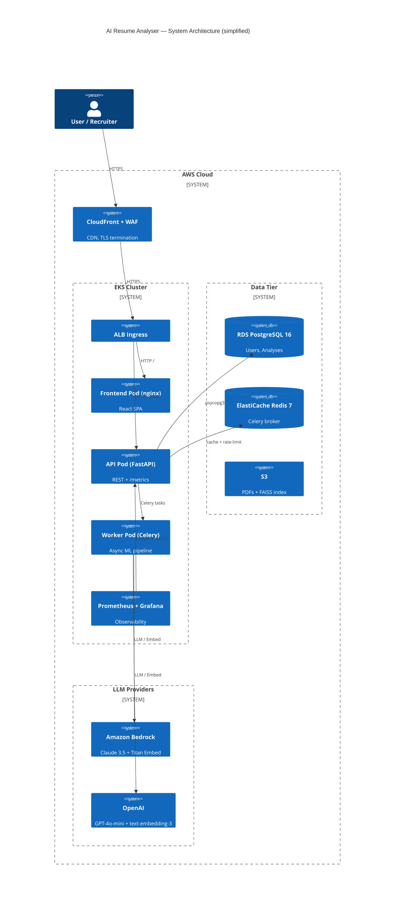

<div align="center">

# 🤖 AI Resume Analyser Pro

**Production-grade resume intelligence — semantic scoring, RAG-grounded LLM feedback, and ATS gap detection**

[](https://github.com/sree-tatikonda/ai-resume-analyser-pro/actions/workflows/ci.yml)
[](LICENSE)
[](https://python.org)
[](https://typescriptlang.org)
[](https://fastapi.tiangolo.com)
[](https://react.dev)
[](docs/DEPLOYMENT.md)
[](docs/DEPLOYMENT.md)
[](backend/Dockerfile)
[](https://codecov.io/gh/sree-tatikonda/ai-resume-analyser-pro)

[**Live Demo**](https://demo.ai-resume-analyser.example.com) · [**API Docs**](https://demo.ai-resume-analyser.example.com/docs) · [**Architecture**](docs/ARCHITECTURE.md) · [**Deployment**](docs/DEPLOYMENT.md)

</div>

---

## TL;DR

AI Resume Analyser Pro is a **full-stack ML platform** that scores a candidate's resume against any job description using a three-layer pipeline: sentence-transformer semantic embeddings (cosine similarity), a curated skills taxonomy with fuzzy matching, and RAG-grounded LLM feedback via OpenAI GPT-4o-mini or Amazon Bedrock Claude 3.5 Sonnet. The weighted score (`50 % semantic · 30 % skill · 20 % experience`) gives recruiters an objective, explainable signal while the LLM generates ATS keyword recommendations and tailored bullet suggestions. The project is deployed on AWS EKS behind CloudFront, managed through Terraform + Helm, with a full Prometheus/Grafana observability stack — making it a **production-ready senior portfolio piece**, not a toy project.

---

## Architecture



> **Full Mermaid source:** [`docs/diagrams/architecture.mmd`](docs/diagrams/architecture.mmd)  
> **Request sequence diagram:** [`docs/diagrams/sequence-analyze.mmd`](docs/diagrams/sequence-analyze.mmd)

---

## Features

- **Hybrid Skill Extraction** — curated ESCO/O*NET-inspired taxonomy (3 000+ skills), alias expansion, and fuzzy matching (RapidFuzz, threshold 85) for zero-miss recall
- **Semantic Similarity Scoring** — sentence-transformer embeddings (all-MiniLM-L6-v2 locally; Titan Embed v2 / OpenAI text-embedding-3-small in cloud) with cosine similarity matrix over resume and JD chunks
- **Weighted Composite Score** — `overall = 0.5 × semantic + 0.3 × skill + 0.2 × experience` — each component independently explainable
- **RAG-Grounded LLM Feedback** — top-k JD chunk retrieval from FAISS / pgvector, injected as context to GPT-4o-mini or Claude 3.5 Sonnet for hallucination-reduced, grounded feedback
- **Pluggable LLM Backend** — strategy pattern; swap between `openai`, `bedrock`, or `local` (Ollama) by changing one env var
- **ATS Keyword Warnings** — detects missing high-frequency JD terms that ATS systems flag
- **Async Pipeline** — Celery + Redis for large PDFs; synchronous fast-path for < 10 MB
- **Full Auth** — JWT bearer tokens (HS256), optional guest mode for frictionless demos
- **Production Observability** — Prometheus metrics (`http_requests_total`, `analysis_duration_seconds`, `llm_tokens_total`), Grafana dashboard auto-provisioned, 12 alert rules
- **Container Security** — non-root images, Trivy scan in CI, SBOM generation, cosign signing (opt-in)
- **Infrastructure as Code** — Terraform (EKS, RDS, ElastiCache, ECR, S3, IAM OIDC), Helm chart with values per env, Kustomize overlays

---

## Tech Stack

| Layer | Technology |
| --- | --- |
| **API** | FastAPI 0.115, Python 3.11, Pydantic v2, SQLAlchemy 2.0, Alembic |
| **ML** | sentence-transformers (all-MiniLM-L6-v2), FAISS, RapidFuzz, PyMuPDF |
| **LLM** | OpenAI GPT-4o-mini, Amazon Bedrock Claude 3.5 Sonnet, local (Ollama) |
| **Embeddings** | sentence-transformers, Amazon Titan Embed v2, OpenAI text-embedding-3-small |
| **Async** | Celery 5, Redis 7 (broker + result backend) |
| **Database** | PostgreSQL 16 (psycopg3), optional pgvector extension |
| **Frontend** | React 18, TypeScript 5, Vite 5, Tailwind CSS, shadcn/ui |
| **Auth** | python-jose (JWT HS256), OAuth2PasswordBearer, slowapi rate-limiter |
| **Observability** | Prometheus, Grafana, structlog (JSON logs), OpenTelemetry (opt-in) |
| **Container** | Docker multi-stage (builder → runtime), non-root `app` user |
| **Orchestration** | Kubernetes 1.29 (EKS), Helm 3.14, Kustomize |
| **IaC** | Terraform 1.7, AWS provider 5.x |
| **CI/CD** | GitHub Actions (parallel jobs, OIDC AWS auth, ECR push, Helm deploy) |
| **Security** | Trivy FS + image scan, SARIF upload, Dependabot, cosign (opt-in) |

---

## Project Structure

<details>
<summary>Click to expand full tree</summary>

```
ai-resume-analyser-pro/
├── .github/
│   ├── workflows/
│   │   ├── ci.yml              # Lint + test + security (parallel jobs)
│   │   ├── build-and-push.yml  # ECR push (matrix: api, worker, frontend)
│   │   ├── deploy.yml          # Helm deploy to EKS (manual + auto on tag)
│   │   └── release.yml         # GitHub Release from tag
│   ├── ISSUE_TEMPLATE/
│   │   ├── bug_report.md
│   │   └── feature_request.md
│   ├── CODEOWNERS
│   ├── dependabot.yml
│   ├── PULL_REQUEST_TEMPLATE.md
│   └── SECURITY.md
├── backend/
│   ├── app/
│   │   ├── api/v1/             # analyses.py, auth.py, health.py
│   │   ├── core/               # config.py, security.py, logging.py
│   │   ├── models/             # SQLAlchemy ORM: user.py, analysis.py
│   │   ├── schemas/            # Pydantic: analysis.py, auth.py
│   │   ├── services/
│   │   │   ├── ai/             # analyzer.py, embeddings.py, vector_store.py
│   │   │   ├── extraction/     # pdf_parser.py, skill_extractor.py, taxonomy.py
│   │   │   ├── llm/            # factory.py, openai_client.py, bedrock_client.py
│   │   │   └── scoring/        # scorer.py (weighted composite)
│   │   ├── utils/              # metrics.py, middleware.py, rate_limit.py
│   │   ├── workers/            # celery_app.py, tasks.py
│   │   └── main.py
│   ├── alembic/                # Database migrations
│   ├── tests/
│   │   ├── unit/               # test_scoring.py, test_skill_extractor.py, …
│   │   └── integration/        # test_health.py
│   ├── Dockerfile              # Multi-stage: builder → runtime
│   ├── Dockerfile.worker
│   ├── pyproject.toml          # ruff + mypy + pytest config
│   └── requirements*.txt
├── frontend/
│   ├── src/                    # React + TypeScript components
│   ├── Dockerfile              # Multi-stage: build → runtime (nginx)
│   └── package.json
├── helm/ai-resume-analyser/    # Helm chart
├── k8s/                        # Kustomize overlays
├── terraform/
│   └── envs/{dev,prod}/        # Terraform workspaces
├── observability/
│   ├── prometheus/             # prometheus.yml, alerts.yml (12 rules)
│   ├── grafana/                # Provisioning + 21-panel dashboard JSON
│   ├── loki/                   # Optional log aggregation
│   └── promtail/               # Optional log shipper
├── docs/
│   ├── ARCHITECTURE.md
│   ├── DEPLOYMENT.md
│   ├── API.md
│   ├── ML.md
│   ├── CONTRIBUTING.md
│   ├── SECURITY.md
│   └── diagrams/               # architecture.mmd, sequence-analyze.mmd
├── docker-compose.yml
├── CHANGELOG.md
├── LICENSE
└── README.md
```

</details>

---

## Quickstart

### Prerequisites

- Docker 24+ and Docker Compose v2
- (Optional) OpenAI API key or AWS credentials for cloud LLMs
- (Optional) Python 3.11 + Node 20 for local dev without Docker

### 1. Clone & configure

```bash
git clone https://github.com/sree-tatikonda/ai-resume-analyser-pro.git
cd ai-resume-analyser-pro

cp backend/.env.example backend/.env
# Edit backend/.env — set OPENAI_API_KEY or leave LLM_PROVIDER=local
```

### 2. Start the stack

```bash
docker-compose up -d
```

This starts: PostgreSQL → Redis → API → Worker → Frontend → Prometheus → Grafana.

| Service | URL |
| --- | --- |
| Frontend | http://localhost:5173 |
| API (docs) | http://localhost:8000/docs |
| Prometheus | http://localhost:9090 |
| Grafana | http://localhost:3001 (admin/admin) |

### 3. Run your first analysis

```bash
# Upload a PDF resume against a job description
curl -X POST http://localhost:8000/api/v1/analyses \
  -F "file=@/path/to/resume.pdf" \
  -F "job_description=We are looking for a Senior Python Engineer with FastAPI, PostgreSQL, and AWS experience..."
```

---

## Configuration

All settings are read from environment variables (`.env` in local dev, Kubernetes Secrets in production).

| Variable | Default | Description |
| --- | --- | --- |
| `APP_ENV` | `dev` | Runtime environment (`dev`/`staging`/`prod`/`test`) |
| `SECRET_KEY` | *(required)* | JWT signing key — use a 64-char random string |
| `DATABASE_URL` | `postgresql+psycopg://...` | PostgreSQL connection string |
| `REDIS_URL` | `redis://localhost:6379/0` | Redis URL for caching |
| `CELERY_BROKER_URL` | `redis://localhost:6379/1` | Celery broker |
| `LLM_PROVIDER` | `openai` | `openai` \| `bedrock` \| `local` |
| `LLM_MODEL` | `gpt-4o-mini` | Model name (provider-specific) |
| `OPENAI_API_KEY` | — | OpenAI API key |
| `AWS_REGION` | `us-east-1` | AWS region for Bedrock |
| `BEDROCK_LLM_MODEL_ID` | `anthropic.claude-3-5-sonnet-20241022-v2:0` | Bedrock model |
| `EMBEDDING_PROVIDER` | `local` | `local` \| `openai` \| `bedrock` |
| `EMBEDDING_MODEL` | `sentence-transformers/all-MiniLM-L6-v2` | Embedding model |
| `S3_BUCKET` | `ai-resume-analyser-dev` | S3 bucket for PDFs |
| `VECTOR_STORE` | `faiss` | `faiss` \| `pgvector` |
| `RATE_LIMIT_ANALYZE_PER_MINUTE` | `10` | Analyze endpoint rate limit per IP |
| `MAX_UPLOAD_SIZE_MB` | `10` | Maximum PDF upload size |
| `PROMETHEUS_ENABLED` | `true` | Expose `/metrics` endpoint |
| `OTEL_ENABLED` | `false` | Enable OpenTelemetry tracing |
| `CORS_ORIGINS` | `http://localhost:5173` | Allowed CORS origins (comma-separated) |

---

## API Examples

### Register and login

```bash
# Register
curl -X POST http://localhost:8000/api/v1/auth/register \
  -H "Content-Type: application/json" \
  -d '{"email": "alice@example.com", "password": "secret123!", "full_name": "Alice Smith"}'

# Login
TOKEN=$(curl -s -X POST http://localhost:8000/api/v1/auth/login \
  -H "Content-Type: application/json" \
  -d '{"email": "alice@example.com", "password": "secret123!"}' \
  | jq -r '.access_token')
```

### Analyze a resume (synchronous)

```bash
curl -X POST http://localhost:8000/api/v1/analyses \
  -H "Authorization: Bearer $TOKEN" \
  -F "file=@resume.pdf" \
  -F "job_description=Senior Python Engineer — FastAPI, PostgreSQL, AWS, Docker, 5+ years..."
```

<details>
<summary>Response (200 OK)</summary>

```json
{
  "id": "3fa85f64-5717-4562-b3fc-2c963f66afa6",
  "status": "completed",
  "resume_filename": "resume.pdf",
  "overall_score": 81.4,
  "semantic_score": 84.2,
  "skill_score": 76.7,
  "experience_score": 82.0,
  "matched_skills": ["Python", "FastAPI", "PostgreSQL", "Docker", "AWS"],
  "missing_skills": ["Kubernetes", "Terraform", "Redis"],
  "llm_feedback": {
    "summary": "Strong Python backend profile with solid FastAPI and AWS experience. Infrastructure gap around container orchestration.",
    "strengths": [
      "Deep FastAPI and async Python expertise",
      "AWS deployment experience (EC2, S3, RDS)",
      "Clean architecture and testing practices"
    ],
    "gaps": [
      "No Kubernetes or Helm experience mentioned",
      "Terraform / IaC missing from resume"
    ],
    "ats_warnings": ["'container orchestration' absent from resume — high-frequency JD term"],
    "recommended_keywords": ["Kubernetes", "Helm", "Terraform", "EKS", "IaC"],
    "seniority_fit": "strong match for Senior level"
  },
  "suggested_bullets": [
    "Containerised FastAPI services with Docker multi-stage builds, reducing image size by 60%",
    "Automated infrastructure provisioning with Terraform managing 12 AWS resources across dev/prod"
  ],
  "llm_provider": "openai",
  "llm_model": "gpt-4o-mini",
  "duration_ms": 3241,
  "created_at": "2026-04-25T10:30:00Z"
}
```
</details>

### Python client

```python
import httpx

client = httpx.Client(base_url="http://localhost:8000/api/v1")

# Login
resp = client.post("/auth/login", json={"email": "alice@example.com", "password": "secret123!"})
token = resp.json()["access_token"]
headers = {"Authorization": f"Bearer {token}"}

# Analyze
with open("resume.pdf", "rb") as f:
    resp = client.post(
        "/analyses",
        headers=headers,
        files={"file": ("resume.pdf", f, "application/pdf")},
        data={"job_description": "Senior Python Engineer with FastAPI and AWS..."},
        timeout=60,
    )

result = resp.json()
print(f"Score: {result['overall_score']:.1f}/100")
print(f"Missing skills: {result['missing_skills']}")
```

### JavaScript / TypeScript

```typescript
const formData = new FormData();
formData.append("file", resumeFile);          // File object from <input type="file">
formData.append("job_description", jdText);

const resp = await fetch("/api/v1/analyses", {
  method: "POST",
  headers: { Authorization: `Bearer ${token}` },
  body: formData,
});

const analysis = await resp.json();
console.log(`Overall score: ${analysis.overall_score}`);
```

---

## Deployment

### Overview

```
Terraform bootstrap  →  ECR push  →  Helm install  →  DNS / ACM  →  Done
```

See [**docs/DEPLOYMENT.md**](docs/DEPLOYMENT.md) for the full step-by-step guide.

### Quick reference

```bash
# 1. Terraform — provision EKS, RDS, ElastiCache, ECR, S3, IAM
cd terraform/envs/prod
terraform init && terraform apply

# 2. Build and push images
IMAGE_TAG=$(git rev-parse --short HEAD)
for SVC in api worker frontend; do
  docker buildx build \
    --platform linux/amd64 \
    -t $ECR_REGISTRY/ai-resume-analyser/$SVC:$IMAGE_TAG \
    --push backend/  # (adjust context per service)
done

# 3. Deploy with Helm
helm upgrade --install ai-resume-analyser helm/ai-resume-analyser \
  --namespace resume-analyser --create-namespace \
  --values helm/ai-resume-analyser/values-prod.yaml \
  --set image.api.tag=$IMAGE_TAG \
  --set image.worker.tag=$IMAGE_TAG \
  --set image.frontend.tag=$IMAGE_TAG \
  --atomic --wait
```

---

## Observability

| Component | URL | Description |
| --- | --- | --- |
| Prometheus | `:9090` | Raw metrics, alert status |
| Grafana | `:3001` | **API Overview** dashboard (21 panels) |
| `/metrics` | `:8000/metrics` | Prometheus exposition format |
| `/api/v1/healthz` | `:8000` | Liveness probe |
| `/api/v1/readyz` | `:8000` | Readiness probe (DB + Redis checks) |

Key metrics instrumented in the application:

```
http_requests_total{method, endpoint, status_code}
http_request_duration_seconds{method, endpoint}
analysis_duration_seconds{llm_provider}
llm_tokens_total{provider, model, kind}      # kind = prompt | completion
analysis_failures_total{reason}
```

Alert rules: `HighErrorRate` (5xx > 1% / 5m), `HighLatencyP95` (> 2s / 10m), `LLMTokenSpike`, `WorkerQueueGrowing`, `PodCrashLooping`, and 7 more — see [`observability/prometheus/alerts.yml`](observability/prometheus/alerts.yml).

---

## Testing

```bash
# Run all tests
cd backend
pytest --cov=app --cov-report=term-missing

# Unit tests only (no DB/Redis required)
pytest tests/unit/ -v

# Integration tests (requires docker-compose services)
pytest tests/integration/ -v

# With coverage threshold enforcement
pytest --cov=app --cov-fail-under=70
```

Test categories:
- **Unit**: skill extractor (taxonomy + fuzzy), scorer (weighted formula), PDF parser, LLM stub client
- **Integration**: health endpoints, analysis lifecycle (mocked LLM), auth flows

---

## What Makes This a Senior Portfolio Piece

<details>
<summary>Design decisions worth highlighting in interviews</summary>

| Decision | Why |
| --- | --- |
| **Pluggable LLM strategy** | Factory pattern (`llm/factory.py`) selects provider at startup — zero code change to switch OpenAI ↔ Bedrock ↔ local. Future: add Anthropic/Cohere without touching caller code. |
| **RAG over JD chunks** | Prevents LLM hallucinating skills not in the JD; top-k FAISS retrieval grounds feedback in actual job requirements. |
| **Hybrid skill matching** | Pure taxonomy → high precision; fuzzy matching → high recall for misspellings / synonyms. The two stages balance each other. |
| **Weighted scoring (50/30/20)** | Semantic similarity alone penalises candidates who use different phrasing for the same skill. The composite addresses phrasing variance while still rewarding exact skill matches. |
| **Three-layer observability** | Metrics (Prometheus) + logs (structlog JSON → Loki) + traces (OTel — opt-in) following the three pillars. Most toy projects have none. |
| **OIDC GitHub → AWS** | No long-lived AWS credentials in CI; role assumed via federated identity with 1h session — follows AWS IAM best practices. |
| **Non-root container + multi-stage build** | Security hardening; wheel-based installation means no compiler toolchain in runtime image. |
| **Alembic migration strategy** | All schema changes are versioned and backward-compatible; rollback via `alembic downgrade -1`. |
| **Rate limiting on analyze endpoint** | `slowapi` + Redis counter prevents abuse of expensive LLM calls without a full API gateway. |

</details>

---

## Roadmap

- [ ] **Async Celery path** — enable via `?async=true` query param; return 202 + task ID for polling
- [ ] **pgvector store** — replace FAISS with pgvector for ACID-safe embedding persistence
- [ ] **Multi-resume comparison** — score N resumes against one JD, ranked table output
- [ ] **Interview question generation** — derive gap-targeted interview questions from missing skills
- [ ] **Recruiter dashboard** — batch upload, comparison table, export to PDF
- [ ] **Evaluation harness** — precision/recall on labeled resume-JD dataset; score correlation with recruiter ratings
- [ ] **Streaming LLM response** — SSE endpoint for real-time feedback streaming to frontend
- [ ] **OpenTelemetry traces** — end-to-end distributed tracing; export to Jaeger / Tempo
- [ ] **MCP server** — expose analysis as a Model Context Protocol tool for AI agents

---

## License

MIT — see [LICENSE](LICENSE)

---

<div align="center">

Built with precision by **Sree Tatikonda**  
If this helped you, consider leaving a ⭐ on GitHub.

</div>
