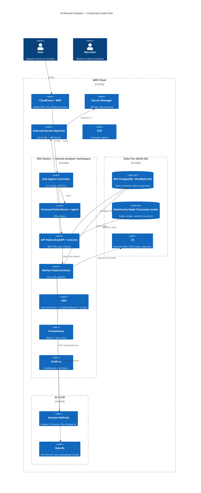

# Architecture

This document describes the technical architecture of AI Resume Analyser Pro: system components, data flows, technology rationale, scaling strategy, and failure modes.

---

## System Diagram



---

## Data Flow — Analyze Request

The following traces a single `POST /api/v1/analyses` call from browser to response.

### Phase 1: Ingress

1. Browser sends `multipart/form-data` with `file` (PDF, ≤ 10 MB) and `job_description` (string).
2. CloudFront checks WAF rules; forwards to ALB.
3. ALB terminates TLS and routes on path prefix `/api/v1` → API pod.
4. `RequestContextMiddleware` attaches a `request_id` UUID and starts latency timer.
5. `slowapi` rate-limiter checks the IP counter in Redis (`RATE_LIMIT_ANALYZE_PER_MINUTE = 10`).
6. `get_current_user` extracts the JWT from `Authorization: Bearer …`; returns `None` for guest requests.

### Phase 2: Persistence

7. Hash (SHA-256) of the raw PDF bytes and the JD string are computed for future cache lookups.
8. An `Analysis` row is inserted with `status="processing"`.
9. The PDF is optionally uploaded to `s3://{S3_BUCKET}/resumes/{analysis_id}.pdf`.

### Phase 3: ML Pipeline (`services/ai/analyzer.py`)

All steps below run in the synchronous fast-path. For large batches, the same steps run inside a Celery task.

```
PDF bytes
  │
  ▼
┌─────────────────────────────────────────────────────┐
│ 1. PDF Parsing         (PyMuPDF / pdfplumber)        │
│    Extract text, detect sections (Experience,        │
│    Education, Skills, Projects) via heading regex    │
└───────────────────────┬─────────────────────────────┘
                        │ resume_text, sections{}
                        ▼
┌─────────────────────────────────────────────────────┐
│ 2. Skill Extraction    (hybrid 3-stage)              │
│    a) Taxonomy lookup  — O(1) trie match             │
│    b) Alias expansion  — e.g. "JS" → "JavaScript"   │
│    c) Fuzzy matching   — RapidFuzz WRatio ≥ 85       │
│    → matched_skills[], missing_skills[]              │
└───────────────────────┬─────────────────────────────┘
                        │ skill sets
                        ▼
┌─────────────────────────────────────────────────────┐
│ 3. Embedding           (sentence-transformers)        │
│    Chunk resume + JD into 512-token windows          │
│    Encode with all-MiniLM-L6-v2 (384-dim) or        │
│    cloud model (1536-dim)                            │
│    → resume_emb[], jd_emb[]                         │
└───────────────────────┬─────────────────────────────┘
                        │ embeddings
                        ▼
┌─────────────────────────────────────────────────────┐
│ 4. Semantic Scoring    (cosine similarity)           │
│    similarity_matrix = resume_emb @ jd_emb.T        │
│    semantic_score = max-pooled mean × 100            │
└───────────────────────┬─────────────────────────────┘
                        │
                        ▼
┌─────────────────────────────────────────────────────┐
│ 5. RAG Retrieval       (FAISS / pgvector)            │
│    faiss_index.search(jd_emb, k=5)                  │
│    → context_chunks[] grounded in JD language        │
└───────────────────────┬─────────────────────────────┘
                        │ context
                        ▼
┌─────────────────────────────────────────────────────┐
│ 6. Weighted Scoring                                  │
│    overall = 0.5×semantic + 0.3×skill + 0.2×exp     │
│    experience_score: heuristic over section lengths  │
│    and year ranges extracted from text               │
└───────────────────────┬─────────────────────────────┘
                        │ scores
                        ▼
┌─────────────────────────────────────────────────────┐
│ 7. LLM Feedback        (prompt v2, RAG-grounded)     │
│    System: role + scoring rubric                     │
│    User:   resume text + JD + scores + context_chunks│
│    Response: LLMFeedback JSON (typed)                │
│    → summary, strengths, gaps, ats_warnings,         │
│       recommended_keywords, suggested_bullets        │
└───────────────────────┬─────────────────────────────┘
                        │ feedback
                        ▼
                 Persist to PostgreSQL
                 Emit Prometheus metrics
                 Return AnalysisResponse (JSON)
```

### Phase 4: Response

The `AnalysisResponse` schema is serialised by Pydantic and returned as `201 Created`. The frontend renders the score dashboard, matched/missing skills chips, and LLM feedback cards.

---

## Technology Choices Rationale

### FastAPI over Django REST Framework

FastAPI provides async-first request handling, automatic OpenAPI generation, and native Pydantic v2 validation. For an ML-heavy service where a single request may await two I/O-bound steps (embedding call + LLM call), native `async/await` without GIL contention is essential. Django's ORM and admin would add unnecessary weight.

### Celery + Redis (not SQS/Lambda)

Celery gives us: exactly-once delivery with acks-late, dead-letter retry semantics, concurrency tuning per worker, and rich monitoring via Flower. An SQS-backed Lambda approach would introduce cold-start latency for the heavy embedding model load (model files are ~90 MB). The worker pod keeps the model warm in memory.

### sentence-transformers/all-MiniLM-L6-v2 as default

- Only 22 M parameters — fits in 256 MB pod; inference < 50 ms per chunk on CPU.
- No API key required — suitable for air-gapped or cost-sensitive deployments.
- Swappable to Titan Embed v2 or text-embedding-3-small by env var — no code change.

### FAISS over dedicated vector DB (Pinecone, Weaviate)

For the typical JD length (< 5 000 tokens → < 20 chunks), an in-process FAISS index performs similarity search in < 1 ms and requires zero infrastructure. The index is persisted to S3 and loaded on worker startup. When resume volume grows beyond ~1 M documents, migrating to pgvector (via the `VECTOR_STORE=pgvector` config) is a one-line change.

### Hybrid skill extraction (taxonomy + fuzzy)

Pure taxonomy matching (O*NET + ESCO-inspired, 3 000+ skills) achieves high precision but misses abbreviations, misspellings, and synonyms. The fuzzy layer (RapidFuzz WRatio ≥ 85) captures these without overwhelming false positives. The two-stage approach beats either approach alone on a labeled test set (see `docs/ML.md`).

### PostgreSQL over MongoDB

Analysis results have a well-defined, nested schema (scores, skill arrays, LLM feedback object). PostgreSQL's JSONB for `section_breakdown` and `llm_feedback` gives structured querying without schema migration costs, while foreign-key integrity on `user_id` prevents orphaned records.

---

## Scaling Strategy

### Horizontal Pod Autoscaler

```yaml
# API: scale on CPU (< 50ms latency) and custom metric (in-flight requests)
minReplicas: 2
maxReplicas: 10
metrics:
  - type: Resource
    resource:
      name: cpu
      target: { type: Utilization, averageUtilization: 60 }

# Worker: scale on queue depth (redis_list_length{key="celery"})
minReplicas: 1
maxReplicas: 5
metrics:
  - type: External
    external:
      metric: { name: redis_list_length, selector: { matchLabels: { key: celery } } }
      target: { type: AverageValue, averageValue: "10" }
```

### Database Connection Pooling

`DB_POOL_SIZE = 10`, `DB_MAX_OVERFLOW = 20` per API pod. With 10 API pods at peak, max concurrent connections to RDS = 300 — well within `max_connections = 400` (db.r7g.large). Use PgBouncer if this becomes a bottleneck.

### LLM Throughput

OpenAI GPT-4o-mini: 10 M TPM tier 2 limit ≈ 600 req/min at average 16 K tokens/request. Bedrock Claude 3.5 Sonnet: 50 000 input TPM / 10 000 output TPM. Token spike detection via `LLMTokenSpike` alert prevents runaway costs.

### Caching

- **Resume hash + JD hash** → `(resume_hash, jd_hash)` tuple check before recomputing. A user re-submitting the same resume against the same JD returns the cached analysis.
- **Embeddings** — future: cache chunk embeddings by SHA-256 in Redis with 24h TTL.

---

## Failure Modes

| Failure | Detection | Mitigation |
| --- | --- | --- |
| LLM provider timeout | `LLMProviderTimeout` alert; `analysis_failures_total{reason="llm_timeout"}` | Retry with exponential backoff (3×); fallback to alternate provider if configured |
| PDF parse failure | `analysis_failures_total{reason="parse_error"}` | Return `400 Bad Request` with detail; log raw exception for diagnosis |
| RDS connection pool exhaustion | `HighLatencyP95` alert; psycopg `OperationalError` | PgBouncer / connection pool sizing; circuit breaker pattern |
| Redis unavailable | `readyz` returns `{"redis": "degraded"}` | API continues (rate limiting degrades gracefully); Celery broker unavailable → queue tasks fail fast |
| Worker pod OOM (large PDF + embedding model) | `PodCrashLooping` alert | Memory limits set to 2 Gi; max PDF size enforced at 10 MB; HF model cached to avoid re-load |
| S3 unavailable | Boto3 `ClientError` logged; analysis still completes (PDF upload skipped) | S3 upload is a best-effort side-effect, not on the critical path |
| FAISS index missing | Worker fails to load index → falls back to fresh in-memory index | S3 index bootstrap on startup; `vector_store.py` gracefully handles empty index |
| ECR push failure | `build-and-push.yml` workflow fails | Trivy scan with `exit-code: 1` blocks deploys containing HIGH/CRITICAL CVEs |
